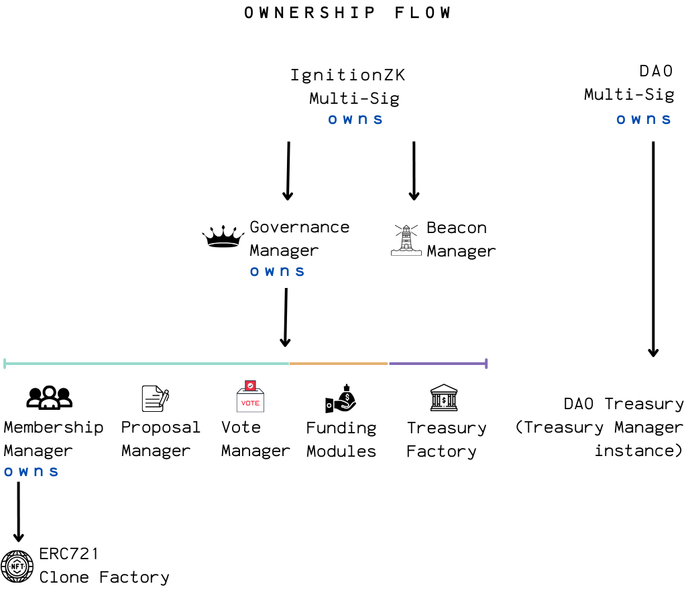
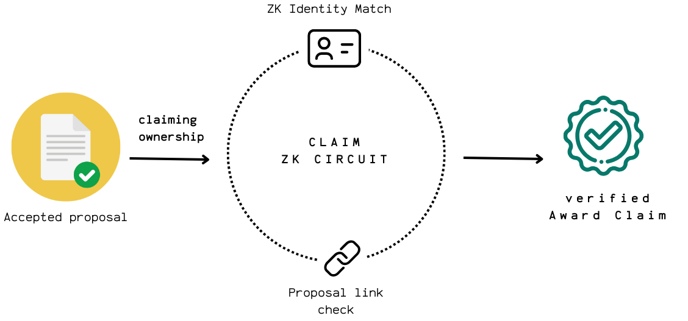
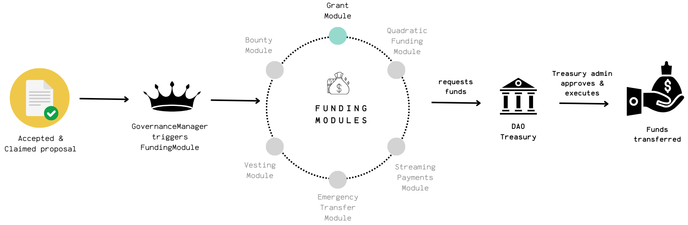

  
  <h1 align="center" style="margin-top: 0.3rem;">IgnitionZK</h1>
  <h3 align="center" style="margin: 0;">ZK-Governed · Modular · Upgradeable Governance & Treasury</h3>

> 🚧 **Project Status**: Alpha - In active development and testing. Not yet ready for production use.

## What is IgnitionZK?

**IgnitionZK** is a privacy-first governance framework for expert groups and DAOs. It combines zero-knowledge cryptography with a modular, upgradeable smart contract system, enabling members to propose, vote, and manage funds anonymously—while ensuring only verified participants can shape outcomes and all actions remain transparent and accountable.

## Table of Contents

* [Key Features](#key-features)
* [IngitionZK Components](#ignitionzk-components)
    * [Layer A: ZK Engine](#layer-a-zk-engine)
    * [Layer B: On-Chain Infrastructure](#layer-b-on-chain-infrastructure)
* [IgnitionZK Lifecycle](#ignitionzk-lifecycle)
    * [Phase 1: DAO Formation and Membership](#phase-1-dao-formation-and-membership)
    * [Phase 2: Anonymous Proposal Submissions](#phase-2-anonymous-proposal-submissions)
    * [Phase 3: Anonymous Voting](#phase-3-anonymous-voting)
    * [Phase 4: Claiming Proposal Awards](#phase-4-claiming-proposal-awards)
    * [Phase 5: Proposal Execution](#phase-5-proposal-execution)

## Key Features 

### 1. **Anonymous Proposals & Voting**

- Members can propose ideas and vote without revealing their identities, thanks to zero-knowledge proofs (ZKPs) and private ZK credentials.

### 2. **NFT-Gated Access**

- DAO membership is managed via non-transferable ERC721 NFTs, ensuring only eligible, real-world-verified members can participate.

### 3. **Upgradeable Smart Contracts**

- Upgradeable controllers for membership, proposals, voting, governance and funding modules built on OpenZeppelin’s UUPS proxy pattern for future-proofing and security.
- Funding modules (such as grants or bounties) are designed as plug-and-play components, managed and deployed by IgnitionZK. 

### 4. **Secure Treasury Management**

- Each group has its own upgradeable beacon proxy treasury, deployed via a factory for fund segregation and risk mitigation.
- All outgoing transfers are subject to a mandatory timelock, giving admins time to review or halt suspicious activity.
- Only authorized multisig admins can approve, execute, or cancel fund transfers, with the ability to lock the treasury in emergencies.

### 5. **Transparent Lifecycle**

- All critical actions (proposals, votes, claims) emit thorough de-anonymized on-chain events for full auditability.
- The governance process is structured into clear phases: Membership, Proposal Submission, Voting, Claiming, and Execution.

### 6. **User Experience**

- Guided workflows for DAO creation, proposal submission, voting, and claims, lowering the barrier for expert groups to launch and operate.
- DAOs can define governance campaign durations and proposal templates to fit their unique needs.

---

[Read more about the system architecture](./docs/architecture.md) 

## IgnitionZK Components

*IgnitionZK's two-layer architecture: ZK Engine (Layer A) and On-Chain Infrastructure (Layer B)*

The IgnitionZK framework combines a zero-knowledge cryptographic engine with a flexible smart contract system. The ZK Engine (Layer A) provides the cryptographic backbone for secure identity and proof generation, while the On-Chain Infrastructure (Layer B) implements the smart contracts that manage the entire governance lifecycle.

## Layer A: ZK Engine

The ZK Engine is the privacy backbone of IgnitionZK. It uses the PLONK protocol and a set of custom circuits to let members prove eligibility, submit proposals, vote, and claim rewards—all without revealing their identity or sensitive data. Off-chain tools help members generate their ZK credentials and manage Merkle trees, while on-chain verifiers check proofs efficiently.

Key components:

* **ZK circuits** for membership, proposals, voting, and claims, each enforcing privacy and uniqueness
* **Verifier contracts** deployed on-chain to validate ZK proofs
* **Scripts and utilities** for generating credentials and updating Merkle trees off-chain

[Read more about the ZK engine](./docs/layerA-zk-engine.md) 

**ZK Circuit Docs**:  
[Membership](./zk/circuits/membership/docs-membership_circuit.md) |
[Proposal](./zk/circuits/proposal/docs-proposal_circuit.md) |
[Vote](./zk/circuits/vote/docs-vote_circuit.md) |
[Claim](./zk/circuits/proposal-claim/docs-proposal_claim_circuit.md)

## Layer B: On-Chain Infrastructure 

*IgnitionZK smart contract ownership flow*

The on-chain layer is built on OpenZeppelin's UUPS proxy pattern for upgradeability and security. **Manager contracts** handle membership, proposals, voting, and treasury operations, **ERC721 NFTs enforce membership**. 
Each group’s treasury is deployed as an **upgradeable beacon proxy**, keeping funds isolated and secure. **Funding modules** are plug-and-play, managed by IgnitionZK, and can be upgraded as needs evolve.

[Read more about the smart contracts layer](./docs/layerB-smart-contracts.md)

## IgnitionZK Lifecycle

### Phase 1: DAO Formation and Membership

*Step 1: NFT-Gated DAO formation*

*Step 2: ZK-Credential generation & Merkle Tree management*

*Step 3: Member verification*

The process begins with deploying an ERC721 contract for membership tokens. Members generate private ZK credentials, and the group’s Merkle tree is updated to reflect the current membership. This ensures only verified members can participate in governance, and all membership changes are tracked on-chain.

[Read more about DAO formation and membership](./docs/lifecycle-phase1-membership.md)

### Phase 2: Anonymous Proposal Submissions

*Step 1: Creating a governance campaign*

*Step 2: Submitting proposals anonymously*

During a governance campaign, members can submit proposals without revealing their identity. Each proposal is tied to a ZK proof that verifies the submitter’s membership and ensures proposal uniqueness. The process is designed to be fair and private, while not allowing duplicate submissions.

[Read more about the proposal submission phase](./docs/lifecycle-phase2-proposals.md)

### Phase 3: Anonymous Voting

*Casting a vote*

Voting is anonymous and verifiable. Members cast their votes using ZK proofs, and the system enforces one vote per member per proposal. All votes are tallied on-chain and proposals pass if they have reached quorum and yes majority.

[Read more about the voting phase](./docs/lifecycle-phase3-voting.md)

### Phase 4: Claiming Proposal Awards

*Proposer submits a ZK-proof to claim ownership of an accepted proposal*

After voting, the original proposer can claim ownership of a successful proposal by submitting a ZK proof. This step links the anonymous proposal to its creator, but only if they choose to claim a reward. The claim is verified on-chain, and the proposal status is updated.

[Read more about proposal claims](./docs/lifecycle-phase4-claims.md)

### Phase 5: Proposal Execution

*Executing a passed proposal and releasing funds from the DAO treasury*

Once a proposal is accepted and claimed, the DAO moves to execution. The system routes the approved proposal to the right funding module, which sends a disbursement request to the group’s treasury. A timelock gives admins time to review or cancel the transfer. After the timelock, the treasury admin can approve and execute the transfer. Emergency locks are available if needed, and every step is logged on-chain for transparency.

[Read more about proposal execution](./docs/lifecycle-phase5-execution.md)
