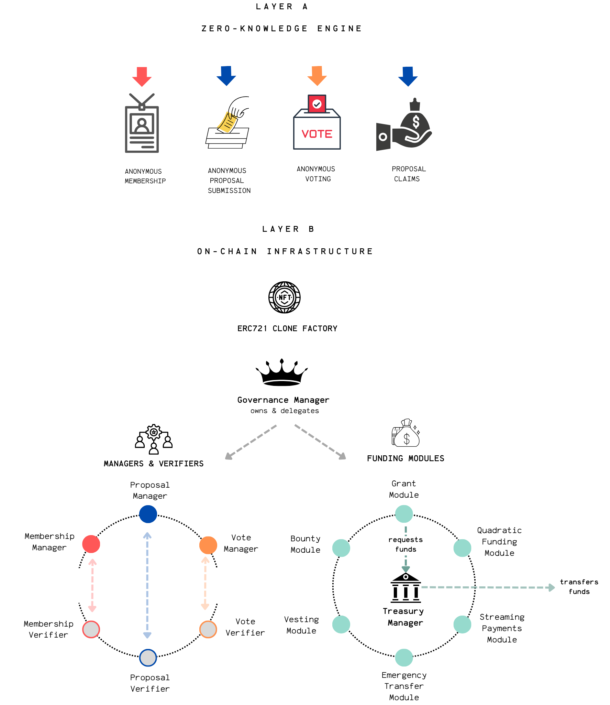
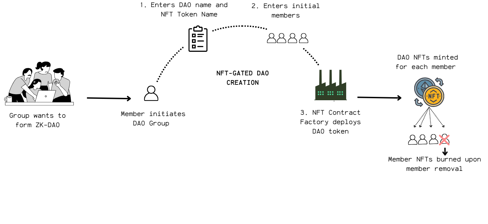
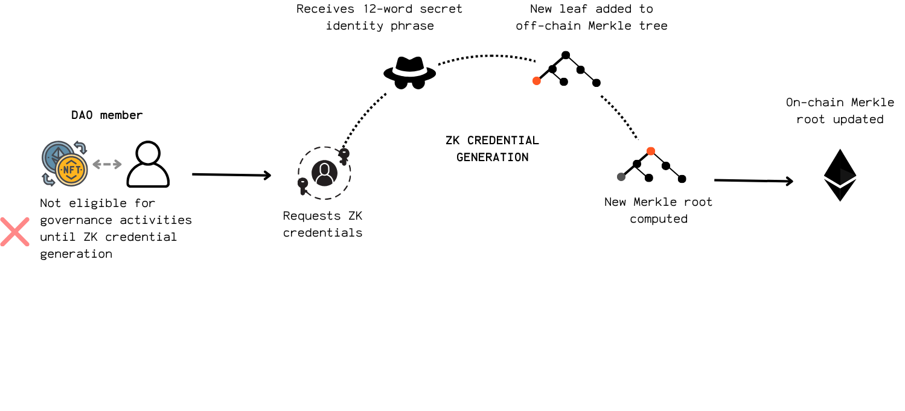
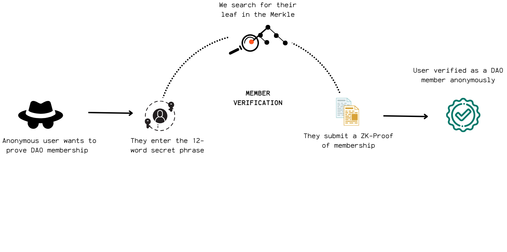

  
  <h1 align="center" style="margin-top: 0.3rem;">IgnitionZK</h1>
  <h3 align="center" style="margin: 0;">ZK-Governed · Modular · Upgradeable Treasury</h3>

  <a href="#quick-start">Getting Started</a> |
  <a href="#">View Demo</a> |
  <a href="./docs/architecture.md">System Architecture</a>

> 🚧 **Project Status**: Alpha - In active development and testing. Not yet ready for production use.

## What is IgnitionZK?

**IgnitionZK** is a privacy-first DAO framework that enables small-to-medium expert groups to govern funds with complete anonymity while maintaining accountability. Using zero-knowledge proofs, members can propose ideas and vote without revealing their identities, while still ensuring that only authorized participants can engage in governance.

### Why Choose IgnitionZK?

- **Privacy + Accountability**: Anonymous proposal creation and voting with verifiable membership
- **Built for Expert Groups**: Optimized for high-impact, focused DAOs where every member matters
- **Fully Modular**: Plug-and-play components with upgradeable infrastructure
- **User-Friendly**: Intuitive UI for DAO creation, proposal submission, and voting

## Table of Contents

* [Key Features & Capabilities](#key-features--capabilities)
* [IngitionZK Components](#ignitionzk-components)
    * [Layer A: ZK Engine](#layer-a-zk-engine)
    * [Layer B: On-Chain Infrastructure](#layer-b-on-chain-infrastructure)
* [IgnitionZK Lifecycle](#ignitionzk-lifecycle)
    * [Phase 1: DAO Formation and Membership](#phase-1-dao-formation-and-membership)
    * [Phase 2: Anonymous Proposal Submissions](#phase-2-anonymous-proposal-submissions)
    * [Phase 3: Anonymous Voting](#phase-3-anonymous-voting)
    * [Phase 4: Proposal Funding Claims & Execution](#phase-4-proposal-funding-claims)

## Key Features & Capabilities

* **Private operations:** Private identity, proposal submission and voting using Zero-Knowledge Proofs
* **Verifiable membership:** Publicly verifiable NFT-gated access ensuring only eligible members with real-world credentials can join.
* **Flexible member management:** Dynamic DAO member handling via NFT mint/burn
* **Flexible funds management:** Flexible treasury logic via pluggable funding modules
* **Streamlined creation:** Intuitive UI for DAO and ERC721 deployment.
* **Delegated control:** Granular role delegation via a Governance Manager.
* **Enhanced engagement:** Fostering high participation and accountability via smaller publicly-verified"expert" groups leading to higher individual stakes and more focused contributions.

## IgnitionZK Layers

*IgnitionZK's two-layer architecture: ZK Engine (Layer A) and On-Chain Infrastructure (Layer B)*

The IgnitionZK framework combines a zero-knowledge cryptographic engine with a flexible smart contract infrastructure, creating a comprehensive system that balances anonymity with accountability. The ZK Engine (Layer A) provides the cryptographic backbone for secure identity and proof generation, while the On-Chain Infrastructure (Layer B) implements the smart contracts that manage the entire governance lifecycle.

## Layer A: ZK Engine

The ZK Engine enables privacy-preserving governance through specialized zero-knowledge circuits and supporting tools. Using the PLONK ZKP protocol and Poseidon hashing, it allows members to prove statements without revealing underlying data.

**Key Components:**
* **ZK Circuits**: Mathematical constructs for proving membership, proposal submission, voting, and claiming
* **Verifier Contracts**: On-chain components that validate proofs without compromising privacy
* **Off-Chain Tooling**: Utilities for generating ZK identities, managing Merkle trees, and creating proofs

[➡️ Detailed ZK Engine Documentation](./docs/layerA-zk-engine.md) 

**ZK Circuit Docs**:  
[Membership](./zk/circuits/membership/docs-membership_circuit.md) |
[Proposal](./zk/circuits/proposal/docs-proposal_circuit.md) |
[Vote](./zk/circuits/vote/docs-vote_circuit.md) |
[Claim](./zk/circuits/proposal-claim/docs-proposal_claim_circuit.md)

## Layer B: On-Chain Infrastructure 

This layer provides the smart contract architecture built on OpenZeppelin's UUPS proxy pattern, ensuring upgradeability and security for all governance operations.

**Key Components:**
* **Manager Contracts**: Upgradeable controllers for membership, proposals, and voting
* **NFT Membership**: ERC721-based tokens for verifiable group membership
* **Governance Manager**: Central coordinator for protocol upgrades and management
* **Treasury System**: Flexible funding modules for resource allocation

[➡️ Detailed Smart Contract Documentation](./docs/layerB-smart-contracts.md) | [Explore Architecture Details](./docs/architecture.md)

## IgnitionZK Lifecycle

### Phase 1: DAO Formation and Membership

*Step 1: NFT-Gated DAO formation*

*Step 2: ZK-Credential generation & Merkle Tree management*

*Step 3: Member verification*

DAO creation begins with deploying an ERC721 contract for membership tokens, followed by credential generation for private governance:

1. **DAO Initiation**: Deploy a custom ERC721 contract for the DAO via minimal proxy pattern
2. **Membership NFTs**: Mint non-transferable NFTs to verified members
3. **ZK Credential Generation**: Members create private identity credentials
4. **Merkle Tree Management**: Update the on-chain Merkle root when new member commitments are generated
5. **Member Verification**: Verify membership via zero-knowledge proofs

[➡️ Detailed Membership Documentation](./docs/lifecycle-phase1-membership.md)

### Phase 2: Anonymous Proposal Submissions

*Step 1: Creating a governance campaign*

*Step 2: Submitting proposals anonymously*

Members anonymously submit proposals during governance campaigns:

1. **Governance Campaign**: Create time-bound governance cycles with custom duration
2. **Proposal Creation**: Submit standardized proposals with clear parameters
3. **Anonymous Verification**: Prove membership and proposal uniqueness via ZK proofs

[➡️ Detailed Proposal Documentation](./docs/lifecycle-phase2-proposals.md)

### Phase 3: Anonymous Voting

DAO members vote on proposals anonymously while maintaining verifiability:

1. **Voting Phase**: Eligible members receive proposals in their app inbox
2. **Anonymous Voting**: Cast Yes/No/Abstain votes via ZK proofs
3. **Result Determination**: Proposals pass with sufficient quorum and majority support
4. **Vote Tally Reveal**: Vote proofs are submitted on-chain for verification only when the voting phase has ended

[➡️ Detailed Voting Documentation](./docs/lifecycle-phase3-voting.md)

### **Phase 4:** Proposal Claims

