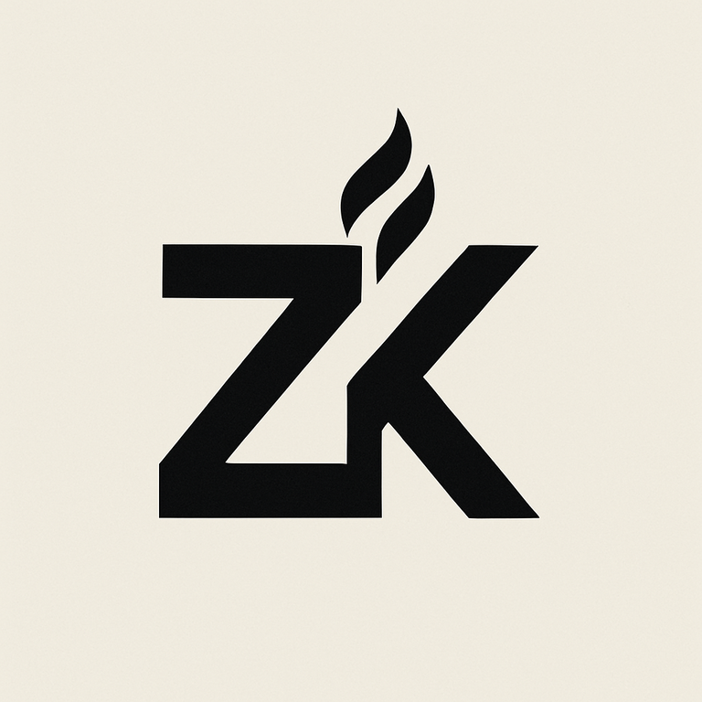
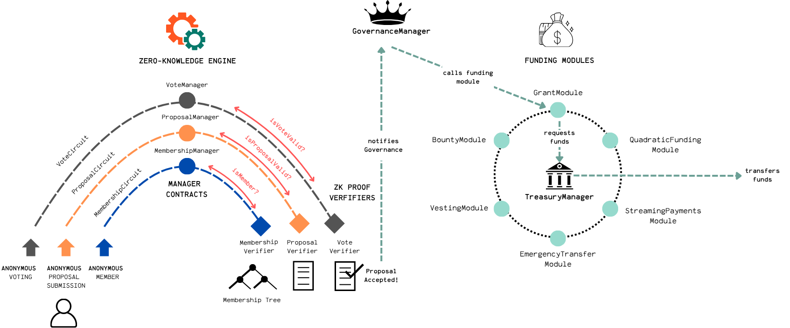
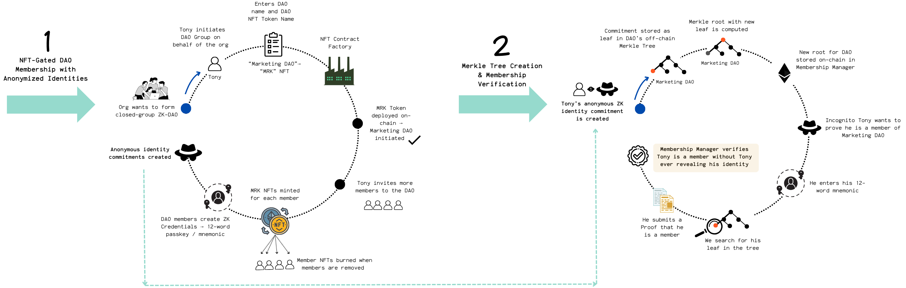

  

# A ZKP-Governed Modular Upgradeable Treasury Framework 
## For High-Impact Closed-Group DAOs

### Summary 

**IgnitionZK** is a fully modular, UUPS-upgradeable, ZK-native DAO framework tailored to small-to-medium closed-group DAOs. It enables:

* **Private operations:** Private identity, proposal submission and voting using Zero-Knowledge Proofs
* **Verifiable membership:** Publicly verifiable NFT-gated access ensuring only eligible members with real-world credentials can join.
* **Flexible member management:** Dynamic DAO member handling via NFT mint/burn
* **Flexible funds management:** Flexible treasury logic via pluggable funding modules
* **Streamlined creation:** Intuitive UI for DAO and ERC721 deployment.
* **Delegated control:** Granular role delegation via a Governance Manager.
* **Enhanced engagement:** Fostering high participation and accountability via smaller publicly-verified"expert" groups leading to higher individual stakes and more focused contributions.

## IgnitionZK Components

## Layer A: ZK Engine (Circuits & Tooling)

This layer forms the cryptographic core of IgnitionZK, enabling privacy-preserving and verifiable interactions through Zero-Knowledge Proofs (ZKPs) and associated off-chain tooling. It's designed to ensure confidential operations while maintaining trustless integrity within the DAO.

### Key Features:
* **ZKP Protocol:** Leverages `circom` for off-chain proof generation using the `PLONK` ZKP Protocol, benefiting from a universal trusted setup.
* **On-Chain Verification:** Dedicated verifiers are deployed on-chain to efficiently check the validity of generated proofs.
* **Comprehensive Off-Chain Tooling:** Provides essential utilities for ZK identity management, Merkle root generation and storage, and the generation of ZKP circuit proofs.
* **Secure Identity Management:** ZK identities are managed via mnemonic seeds, HKDF, Poseidon hashing, and Merkle Trees, ensuring robust and private member authentication.

### ZK Circuit Components:

The Circom circuits are the mathematical backbone of IgnitionZK's privacy logic. They empower DAO members to submit and vote on proposals confidentially, ensuring uniqueness and integrity through cryptographic commitments and nullifiers without revealing sensitive details.

| Circuit | Summary | Verification Context | Included | Input Signals | Public Output Signals | Circuit Constraints | On-Chain Constraints |
|---|---|---|---|---|---|---|---|
| [Membership](zk/circuits/membership/membership_circuit.circom) | Private verification of DAO membership via ZK credentials & Merkle proofs. | Per-DAO | | <ul><li>`root`<li>`group hash`<li>`identity trapdoor`<li>`identity nullifier`<li>`path elements`<li>`path indices`</ul> | <ul><li>`root`<li>`group hash`<li>`membership nullifier`</ul> | `isMember === 1` | Unique `membership nullifier` |
| [Proposal Submission](zk/circuits/proposal/proposal_circuit.circom) | Private submission of funding proposals from verified DAO members, with content validation & deduplication. | Per-DAO, Per-EPOCH | Membership Proof | <ul><li>Membership inputs<li>`proposal content hash`<li>`proposal title hash`<li>`proposal description hash`<li>`proposal payload hash`<li>`epoch hash`</ul> | <ul><li>`proposal context hash`<li>`proposal nullifier`<li>`root`<li>`proposal content hash`</ul> | `isMember === 1` `Poseidon(title, desc, payload) === ContentHash` | Unique `proposal nullifier` |
| [Voting](zk/circuits/voting/voting_circuit.circom) | Confidential voting by verified DAO members, with content validation & deduplication. | Per-DAO, Per-EPOCH, Per-PROPOSAL | Membership Proof | <ul><li>Membership inputs</ul> | ... | ... | Unique `voting nullifier` |

### ZK Off-Chain Tooling:

A dedicated set of off-chain scripts and utilities orchestrates the entire ZKP lifecycle. These tools facilitate the secure creation of ZK identities (generating identity trapdoors and nullifiers), the dynamic construction and storage of Merkle Trees, and the efficient generation of proofs for all integrated ZK circuits.

| Core Script | Class | Summary | Primitives Used | Key Methods |
|---|---|---|---|---|
| [generateCredentials.js](frontend/src/scripts/generateCredentials.js) | `ZkCredentials` | Manages ZK identity: seeds, keys, credentials. | <ul><li>Mnemonic Seeds<li>HKDF<li>Keccak256<li>Poseidon Hash</li></ul> | <ul><li>`generateMnemonicSeed`<li>`generateSeedFromMnemonic`<li>`generateKeys`<li>`generateIdentity`<li>`generateCredentials`</ul> |
| [merkleTreeService.js](frontend/src/scripts/merkleTreeService.js) | `MerkleTreeService` | Creates Merkle trees & generates proofs. | <ul><li>Merkle Trees<li>Poseidon Hash</li></ul> | <ul><li>`createMerkleTree`<li>`generateMerkleProof`</ul> |
| [generateZKProof.js](frontend/src/scripts/generateZKProof.js) | `ZKProofGenerator` | Generates ZK proofs for circuits. | <ul><li>ZKPs (PLONK)<li>Poseidon Hash<li>Merkle Trees<li>Calldata Encoding</li></ul> | <ul><li>`generateMembershipCircuitInput`<li>`generateProposalCircuitInput`<li>`generateProof`<li>`verifyProofOffChain`<li>`generateSolidityCalldata`</ul> |

## Layer B: Core On-Chain Infrastructure 

This layer provides the foundational smart contract architecture, ensuring the framework's upgradeability, modularity, and secure operation. Built upon OpenZeppelin's **UUPS (ERC-1967) proxy pattern**, it allows for seamless, future-proof enhancements without requiring redeployment.

### Key Features:

* **Upgradeability:** Core manager contracts (Membership, Proposal, Voting) are fully upgradeable via the Governance Manager.
* **NFT Clone Factory:** Utilizes lightweight minimal proxies, aka "clones" (EIP-1167), for efficient ERC721 contract deployment.
* **NFT-Gated Access:** Implements a robust ERC721-gated mechanism for controlling DAO membership.
* **Role-Based Security:** Granular, role-gated execution ensures secure control over critical membership, proposal, and voting logic.
* **Extensible Treasury:** Supports dynamic plug-in funding modules for flexible treasury management.

| Smart Contract | Function | Type | Stores | Responsibilities | Owner |
|---|---|---|---|---|---|
| [Membership Manager](hardhat/contracts/managers/MembershipManager.sol) | ZK Engine | UUPS ERC-1967 | <ul><li>Merkle roots</ul>| <ul><li>Deploy Group NFTs<li>Manage DAO members</ul> | Governance Mgr
| [Proposal Manager](hardhat/contracts/managers/ProposalManager.sol)  | ZK Engine | UUPS ERC-1967 | <ul><li>Proposal Nullifiers<li>Content Hash</ul> | <ul><li>Verify proposal submissions</ul> | Governance Mgr
| [Voting Manager](hardhat/contracts/managers/VotingManager.sol) | ZK Engine | UUPS ERC-1967 | <ul><li>Vote Nullifiers<li>Content Hash</ul> | <ul><li>Verify vote validity</ul> | Governance Mgr
| [Proposal Verifier](hardhat/contracts/verifiers/ProposalVerifier.sol) |  ZK Engine | Immutable | | <ul><li>Verify proposal proofs (via PM)</ul> | Unrestricted
| [Voting Verifier](hardhat/contracts/verifiers/VotingVerifier.sol) | ZK Engine | Immutable | | <ul><li>Verify voting proofs (via VM)</ul> | Unrestricted
| [ERC721IgnitionZK](hardhat/contracts/token/ERC721IgnitionZK.sol) | NFT Factory  | Clone EIP-1167 | | <ul><li>Deploy NFT Clones for DAOs</ul> | Membership Mgr
| [Governance Manager](hardhat/contracts/governance/GovernanceManager.sol)  | Governance | UUPS ERC-1967 |.. | <ul><li>Delegate calls to Managers</ul> | Multi-sig
| Treasury Manager | Treasury | ... | ... | ... | Governance Mgr
| Grant Module | Funding Module | ... | ... | ... | Governance Mgr
| Quadratic Funding Module | Funding Module | ... | ... | ... | Governance Mgr

# IgnitionZK Lifecycle
### **Phase 1:** DAO creation & Membership Management

#### Step 1.1 DAO Initiation via ERC721 contract deployment

A DAO is initiated when a ERC721 contract with the DAO's name and token symbol is deployed. This is achieved through a minimal proxy EIP-1167  contract: a main, immutable ERC721 contract is deployed (implementation contract) which acts like a contract factory for all subsequent clones. 

Implementation Contract: [ERC721IgnitionZK](hardhat/contracts/token/ERC721IgnitionZK.sol)

#### Key Features:
* Using OpenZeppelin's AccessControl library for explicit role-based access for minting and burning tokens:
    * `default_admin_role`, `minter_role`, `burner_role`: granted to Membership Manager
    * gated access to role trasfers via delegated functions only callable by the Governance Manager
* ERC721 Token name and symbol defined by the user in the UI

#### Data Flow:

* User enters new DAO's data on the UI.
* Relayer calls `GovernanceManager.delegateDeployGroupNft`.
* `GovernanceManager` function calls `MembershipManager.deployGroupNft(bytes32 groupKey, string calldata name, string calldata symbol)`.
* New DAO NFT address is saved:
    * **Off-chain:** in `ignitionzk.groups`
    * **On-chain:** in `MembershipManager`'s `groupNftAddresses` mapping.

#### Step 1.2 ERC721 membership NFTs

The appointed administrator of a new DAO group extends invitations to the initial cohort of members through the UI. This immediately prompts the minting of ERC721 membership NFTs from the DAO's dedicated contract. Each minted NFT serves as verifiable proof of their valid group membership.

#### Key Features:
* **Soulbound:** Membership NFTs are intentionally non-transferable, ensuring that DAO participation is exclusively tied to the individual's verified identity and eligibility within the real-world group.
* **Burnable:** When a member's affiliation with the real-world group ceases, their active DAO participation is terminated through the burning of their corresponding membership NFT.

#### Data Flow:

* DAO Administrator enters members' addresses on the UI
* Relayer calls `GovernanceManager.delegateMintNftToMember`
* `GovernanceManager` function calls `MembershipManager.mintNftToMember`
* The MembershipManager mints a new ERC721 membership NFT directly to each invited member's wallet.
* These new DAO members are recorded via anonymized `group_member_id`s **off-chain** within ` ignitionzk.group_members`; there is **no on-chain storage** of individual member addresses or IDs.

#### Step 1.3 Member ZK credential generation

Only members actively holding one of the DAO's valid membership NFTs are eligible to proceed with generating their Zero-Knowledge credentials for private interactions within the DAO.

#### Key Methodology
*Main Script: [generateCredentials.js](frontend/src/scripts/generateCredentials.js)*

The cryptographic steps involved in securely generating a unique Zero-Knowledge identity for each DAO member are as follows:
* **Mnemonic phrase generation:** A random 12-word mnemonic phrase is generated from 128 bits of entropy, serving as the foundational secret.
* **Seed derivation:** A cryptographic seed is securely derived from this mnemonic phrase.
* **Identity key derivation:** Using HKDF (HMAC-based Key Derivation Function) with the mnemonic seed, the essential trapdoor and nullifier keys are deterministically derived.
* **Final identity components:** The ultimate identity trapdoor and identity nullifier values are then computed via the SNARK-friendly Poseidon hash function.
* **Identity commmitment:** The final public identity commitment is calculated as a Poseidon hash of these two private components: `commitment = Poseidon(trapdoor, nullifier)` 
#### Data Flow:

* An eligible DAO member logs into their personal dashboard.
* The member searches for and selects the specific DAO for which they are eligible to generate ZK credentials.
* The chosen DAO group is added to their personal dashboard, and the member is prompted to generate their credentials.
* Upon clicking "Generate Credentials," the member is securely presented with their newly generated mnemonic phrase.
* The member's newly formed identity commitment is then stored off-chain in `ignitionzk.merkle_tree_leaves` (this commitment later contributes to the Merkle tree root on-chain).

#### Step 1.4 Merkle Tree creation 
#### Step 1.5 Off-Chain & On-Chain storage
#### Step 1.6 Member verification methodology

### **Phase 2:** Proposal Submissions
### **Phase 3:** Voting
### **Phase 4:** Proposal Execution

