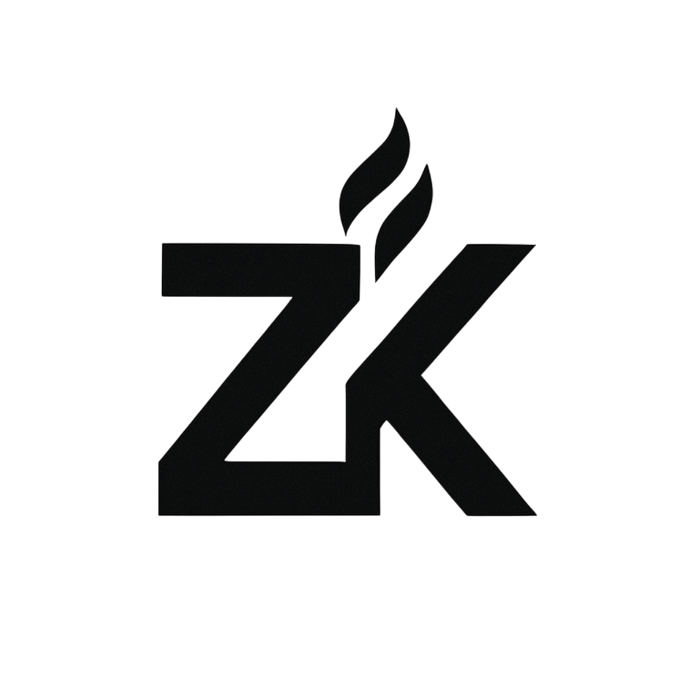
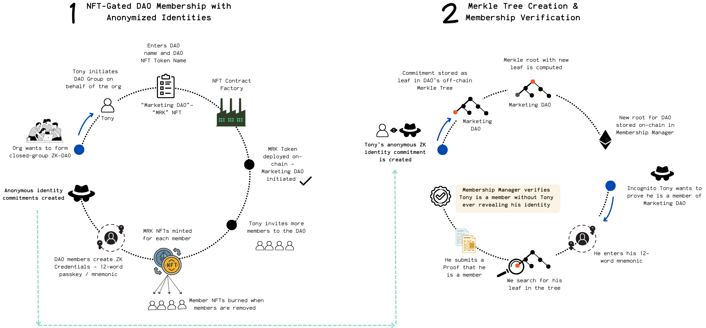
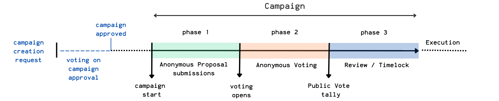
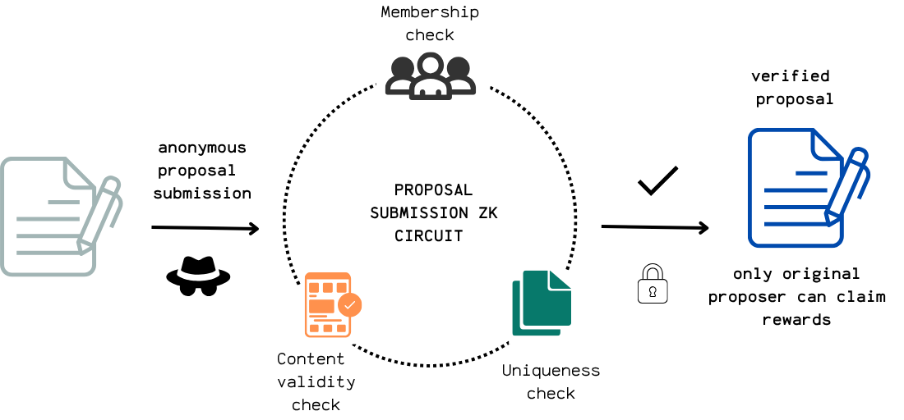
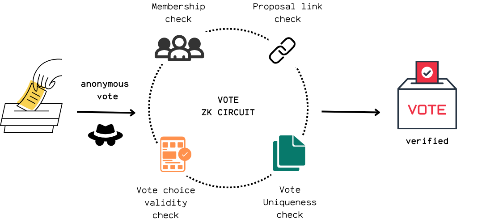
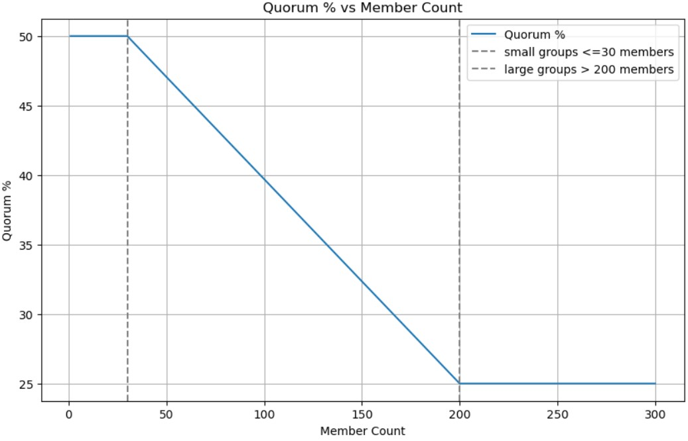

  
  <h1 style="margin-top: 0.5rem;">IgnitionZK</h1>
  <h3 style="font-weight: 500; margin-top: 0;">ZK-Governed · Modular · Upgradeable Treasury</h3>
  
For High-Impact Closed-Group DAOs

## What is IgnitionZK?

**IgnitionZK** is a privacy-first DAO framework that enables small-to-medium expert groups to govern funds with complete anonymity while maintaining accountability. Using zero-knowledge proofs, members can propose ideas and vote without revealing their identities, while still ensuring that only authorized participants can engage in governance.

### Why Choose IgnitionZK?

- **Privacy + Accountability**: Anonymous proposal creation and voting with verifiable membership
- **Built for Expert Groups**: Optimized for high-impact, focused DAOs where every member matters
- **Fully Modular**: Plug-and-play components with upgradeable infrastructure
- **User-Friendly**: Intuitive UI for DAO creation, proposal submission, and voting

[Getting Started](#quick-start) | [View Demo](#) | [Key System Architecture](./docs/architecture.md) | 
ZK Circuits Documentation: [Membership Circuit](./zk/circuits/membership/docs-membership_circuit.md) |[Proposal Circuit](./zk/circuits/proposal/docs-proposal_circuit.md) | [Vote Circuit](./zk/circuits/vote/docs-vote_circuit.md) | [Proposal Claim Circuit](./zk/circuits/proposal-claim/docs-proposal_claim_circuit.md)

---

## Table of Contents

* [Key Features & Capabilities](#key-features--capabilities)
* [IngitionZK Components](#ignitionzk-components)
    * [Layer A: ZK Engine](#layer-a-zk-engine)
        * [ZK Circuit Components](#zk-circuit-components)
        * [ZK Off-Chain Tooling](#zk-off-chain-tooling)
    * [Layer B: Core On-Chain Infrastructure](#layer-b-core-on-chain-infrastructure)
* [IgnitionZK Lifecycle](#ignitionzk-lifecycle)
    * [Phase 1: DAO Formation and Membership](#phase-1-dao-formation-and-membership)
        * [Step 1.1 DAO Initiation](#step-11-dao-initiation)
        * [Step 1.2 ERC721 Membership NFTs](#step-12-erc721-membership-nfts)
        * [Step 1.3 Member ZK Credential Generation](#step-13-member-zk-credential-generation)
        * [Step 1.4 Merkle Tree Creation](#step-14-merkle-tree-creation)
        * [Step 1.5 Member Verification](#step-14-member-verification)
    * [Phase 2: Anonymous Proposal Submissions](#phase-2-anonymous-proposal-submissions)
        * [Step 2.1 The Governance "Campaign"](#step-21-the-governance-campaign)
        * [Step 2.2 Proposal Creation](#step-22-proposal-creation)
        * [Step 2.3 Anonymous Verifiable Submissions](#step-23-anonymous-verifiable-submissions)
    * [Phase 3: Anonymous Voting](#phase-3-anonymous-voting)
        * [Step 3.1 Voting Phase](#step-31-voting-phase)
        * [Step 3.2 Anonymous Vote Submissions](#step-32-anonymous-vote-submissions)
        * [Step 3.3 Vote Tally Reveal](#step-33-vote-tally-reveal)
    * [Phase 4: Proposal Funding Claims](#phase-4-proposal-funding-claims)

## Key Features & Capabilities

* **Private operations:** Private identity, proposal submission and voting using Zero-Knowledge Proofs
* **Verifiable membership:** Publicly verifiable NFT-gated access ensuring only eligible members with real-world credentials can join.
* **Flexible member management:** Dynamic DAO member handling via NFT mint/burn
* **Flexible funds management:** Flexible treasury logic via pluggable funding modules
* **Streamlined creation:** Intuitive UI for DAO and ERC721 deployment.
* **Delegated control:** Granular role delegation via a Governance Manager.
* **Enhanced engagement:** Fostering high participation and accountability via smaller publicly-verified"expert" groups leading to higher individual stakes and more focused contributions.

## IgnitionZK Components

## Layer A: ZK Engine

This layer forms the cryptographic core of IgnitionZK, enabling privacy-preserving and verifiable interactions through Zero-Knowledge Proofs (ZKPs) and associated off-chain tooling. It's designed to ensure confidential operations while maintaining trustless integrity within the DAO.

### Key Features:
* **ZKP Protocol:** Leverages `circom` for off-chain proof generation using the `PLONK` ZKP Protocol, benefiting from a universal trusted setup.
* **On-Chain Verification:** Dedicated verifiers are deployed on-chain to efficiently check the validity of generated proofs.
* **Comprehensive Off-Chain Tooling:** Provides essential utilities for ZK identity management, Merkle root generation and storage, and the generation of ZKP circuit proofs.
* **Secure Identity Management:** ZK identities are managed via mnemonic seeds, HKDF, Poseidon hashing, and Merkle Trees, ensuring robust and private member authentication.

### ZK Circuit Components

The Circom circuits are the mathematical backbone of IgnitionZK's privacy logic. They empower DAO members to submit and vote on proposals confidentially, ensuring uniqueness and integrity through cryptographic commitments and nullifiers without revealing sensitive details.

    <strong>ZK Circuit Components & Responsibilities</strong>

| Circuit | Summary | Verification Context | Included | Input Signals | Public Output Signals | Circuit Constraints | On-Chain Constraints |
|---|---|---|---|---|---|---|---|
| [Membership](zk/circuits/membership/membership_circuit.circom) | Private verification of DAO membership via ZK credentials & Merkle proofs. | Per-DAO | | <ul><li>`root`<li>`group hash`<li>`identity trapdoor`<li>`identity nullifier`<li>`path elements`<li>`path indices`</ul> | <ul><li>`root`<li>`group hash`<li>`membership nullifier`</ul> | `isMember === 1` | Unique `membership nullifier` |
| [Proposal Submission](zk/circuits/proposal/proposal_circuit.circom) | Private submission of funding proposals from verified DAO members, with content validation & deduplication. | Per-DAO, Per-EPOCH | Membership Proof | <ul><li>Membership inputs<li>`proposal content hash`<li>`proposal title hash`<li>`proposal description hash`<li>`proposal payload hash`<li>`proposal metadata hash`<li> `proposal funding hash` <li>`epoch hash`</ul> | <ul><li>`proposal context hash`<li>`proposal submission nullifier` <li>`proposal claim nullifier`<li>`root`<li>`proposal content hash`</ul> | `isMember === 1` `Poseidon(title, desc, payload) === ContentHash` | Unique `proposal submission nullifier` |
| [Vote](zk/circuits/vote/vote_circuit.circom) | Confidential voting by verified DAO members, with content validation, submisison nullifier and vote uniqueness verification. | Per-DAO, Per-EPOCH, Per-PROPOSAL | Membership Proof | <ul><li>Membership inputs <li> `vote choice` <li> `epoch hash` <li> `proposal hash`<li> `proposal submission nullifier` <li>`proposal title hash`<li>`proposal description hash`<li>`proposal payload hash`<li>`proposal metadata hash`<li> `proposal funding hash`</ul> | <ul><li> `vote context hash` <li> `vote nullifier` <li> `onchain verifiable vote choice hash` <li> `root` <li> `submission nullifier`</ul> | `isValidVoteChoice === 1` &`computedProposalSubmissionNullifier === proposalSubmissionNullifier` | Unique `vote nullifier` |
| [Proposal Claim](zk/circuits/proposal-claim/proposal_claim_circuit.circom) | Confidential verification that a reward claim for an accepted proposal is made by its original anonymous creator. | Per-PROPOSAL, Per-Submitter | Membership Proof | <ul><li>Membership inputs <li>`proposal submisison nullifer` <li>`proposal claim nullifier` <li>`proposal context hash` <li>`identity nullifier` </ul> | <li>`proposal submisison nullifer` <li>`proposal claim nullifier` <li>`proposal context hash` | `computedClaimNullifier === proposalClaimNullifier` | Unique `claim nullifier` |

### ZK Off-Chain Tooling

A dedicated set of off-chain scripts and utilities orchestrates the entire ZKP lifecycle. These tools facilitate the secure creation of ZK identities (generating identity trapdoors and nullifiers), the dynamic construction and storage of Merkle Trees, and the efficient generation of proofs for all integrated ZK circuits.

    <strong>Core Script Modules & Responsibilities</strong>

| Core Script | Class | Summary | Primitives Used | Key Methods |
|---|---|---|---|---|
| [generateCredentials.js](frontend/src/scripts/generateCredentials.js) | `ZkCredentials` | Manages ZK identity: seeds, keys, credentials. | <ul><li>Mnemonic Seeds<li>HKDF<li>Keccak256<li>Poseidon Hash</li></ul> | <ul><li>`generateMnemonicSeed`<li>`generateSeedFromMnemonic`<li>`generateKeys`<li>`generateIdentity`<li>`generateCredentials`</ul> |
| [merkleTreeService.js](frontend/src/scripts/merkleTreeService.js) | `MerkleTreeService` | Creates Merkle trees & generates proofs. | <ul><li>Merkle Trees<li>Poseidon Hash</li></ul> | <ul><li>`createMerkleTree`<li>`generateMerkleProof`</ul> |
| [generateZKProof.js](frontend/src/scripts/generateZKProof.js) | `ZKProofGenerator` | Generates ZK proofs for circuits. | <ul><li>ZKPs (PLONK)<li>Poseidon Hash<li>Merkle Trees<li>Calldata Encoding</li></ul> | <ul><li>`generateMembershipCircuitInput`<li>`generateProposalCircuitInput`<li>`generateProof`<li>`verifyProofOffChain`<li>`generateSolidityCalldata`</ul> |

## Layer B: Core On-Chain Infrastructure 

This layer provides the foundational smart contract architecture, ensuring the framework's upgradeability, modularity, and secure operation. Built upon OpenZeppelin's **UUPS (ERC-1967) proxy pattern**, it allows for seamless, future-proof enhancements without requiring redeployment.

### Key Features:

* **Upgradeability:** Core manager contracts (Membership, Proposal, Voting) are fully upgradeable via the Governance Manager.
* **NFT Clone Factory:** Utilizes lightweight minimal proxies, aka "clones" (EIP-1167), for efficient ERC721 contract deployment.
* **NFT-Gated Access:** Implements a robust ERC721-gated mechanism for controlling DAO membership.
* **Role-Based Security:** Granular, role-gated execution ensures secure control over critical membership, proposal, and voting logic.
* **Extensible Treasury:** Supports dynamic plug-in funding modules for flexible treasury management.

    <strong>Smart Contract Modules and Responsibilities</strong>

| Smart Contract | Function | Type | Stores | Responsibilities | Owner |
|---|---|---|---|---|---|
| [Membership Manager](hardhat/contracts/managers/MembershipManager.sol) | ZK Engine | UUPS ERC-1967 | <ul><li>Merkle roots</ul>| <ul><li>Deploy Group NFTs<li>Manage DAO members <li> Verify DAO membership </ul> | Governance Mgr
| [Proposal Manager](hardhat/contracts/managers/ProposalManager.sol)  | ZK Engine | UUPS ERC-1967 | <ul><li>Proposal submission nullifiers <li> Proposal claim nullifiers</ul> | <ul><li>Verify proposal submissions <li>Verify proposal claims</ul> | Governance Mgr
| [Vote Manager](hardhat/contracts/managers/VoteManager.sol) | ZK Engine | UUPS ERC-1967 | <ul><li>Vote Nullifiers<li>Proposal results: tally, passed status<li> quorum parameters <li> group member count and quorum </ul> | <ul><li>Verify vote validity <li> Store and update proposal status </ul> | Governance Mgr
| [Membership Verifier](hardhat/contracts/verifiers/MembershipVerifier.sol) |  ZK Engine | Immutable | | <ul><li>Verify DAO membership claims (via MM)</ul> | Unrestricted
| [Proposal Submission Verifier](hardhat/contracts/verifiers/ProposalVerifier.sol) |  ZK Engine | Immutable | | <ul><li>Verify proposal submission proofs (via PM)</ul> | Unrestricted
| [Proposal Claim Verifier](hardhat/contracts/verifiers/ProposalVerifier.sol) |  ZK Engine | Immutable | | <ul><li>Verify proposal claim proofs (via PM)</ul> | Unrestricted
| [Vote Verifier](hardhat/contracts/verifiers/VoteVerifier.sol) | ZK Engine | Immutable | | <ul><li>Verify voting proofs (via VM)</ul> | Unrestricted
| [ERC721IgnitionZK](hardhat/contracts/token/ERC721IgnitionZK.sol) | NFT Factory  | Clone EIP-1167 | | <ul><li>Deploy NFT Clones for DAOs</ul> | Membership Mgr
| [Governance Manager](hardhat/contracts/governance/GovernanceManager.sol)  | Governance | UUPS ERC-1967 | | <ul><li>Delegate calls to Managers via the relayer </ul> | Multi-sig
| Treasury Manager | Treasury | ... | ... | ... | Governance Mgr
| Grant Module | Funding Module | ... | ... | ... | Governance Mgr
| Quadratic Funding Module | Funding Module | ... | ... | ... | Governance Mgr

---

# IgnitionZK Lifecycle
### Phase 1: DAO Formation and Membership

#### Step 1.1 DAO Initiation

A DAO is initiated when a ERC721 contract with the DAO's name and token symbol is deployed. This is achieved through a minimal proxy EIP-1167  contract: a main, immutable ERC721 contract is deployed (implementation contract) which acts like a contract factory for all subsequent clones. 

    <strong>Key Features</strong>

Implementation Contract: [ERC721IgnitionZK](hardhat/contracts/token/ERC721IgnitionZK.sol)

* Using OpenZeppelin's AccessControl library for explicit role-based access for minting and burning tokens:
    * `default_admin_role`, `minter_role`, `burner_role`: granted to Membership Manager
    * gated access to role trasfers via delegated functions only callable by the Governance Manager
* ERC721 Token name and symbol defined by the user in the UI

<!--

    <strong>Data Flow</strong>

* User enters new DAO's data on the UI.
* Relayer calls `GovernanceManager.delegateDeployGroupNft`.
* `GovernanceManager` function calls `MembershipManager.deployGroupNft(bytes32 groupKey, string calldata name, string calldata symbol)`.
* New DAO NFT address is saved:
    * **Off-chain:** in `ignitionzk.groups`
    * **On-chain:** in `MembershipManager`'s `groupNftAddresses` mapping.

-->

#### Step 1.2 ERC721 Membership NFTs

The appointed administrator of a new DAO group extends invitations to the initial cohort of members through the UI. This immediately prompts the minting of ERC721 membership NFTs from the DAO's dedicated contract. Each minted NFT serves as verifiable proof of their valid group membership.

    <strong>Key Features</strong>

* **Soulbound:** Membership NFTs are intentionally non-transferable, ensuring that DAO participation is exclusively tied to the individual's verified identity and eligibility within the real-world group.
* **Burnable:** When a member's affiliation with the real-world group ceases, their active DAO participation is terminated through the burning of their corresponding membership NFT.

<!--

    <strong>Data Flow</strong>

1. DAO Administrator enters members' addresses on the UI
2. Relayer calls `GovernanceManager.delegateMintNftToMember`
3. `GovernanceManager` function calls `MembershipManager.mintNftToMember`
4. The MembershipManager mints a new ERC721 membership NFT directly to each invited member's wallet.
5. These new DAO members are recorded via anonymized `group_member_id`s **off-chain** within ` ignitionzk.group_members`; there is **no on-chain storage** of individual member addresses or IDs.

-->

#### Step 1.3 Member ZK Credential Generation

Only members actively holding one of the DAO's valid membership NFTs are eligible to proceed with generating their Zero-Knowledge credentials for private interactions within the DAO.

    <strong>Methodology</strong>

*Script: [generateCredentials.js](frontend/src/scripts/generateCredentials.js)*

The cryptographic steps involved in securely generating a unique Zero-Knowledge identity for each DAO member are as follows:
1. **Mnemonic phrase generation:** A random 12-word mnemonic phrase is generated from 128 bits of entropy, serving as the foundational secret.
2. **Seed derivation:** A cryptographic seed is securely derived from this mnemonic phrase.
3. **Identity key derivation:** Using HKDF (HMAC-based Key Derivation Function) with the mnemonic seed, the essential trapdoor and nullifier keys are deterministically derived.
4. **Final identity components:** The ultimate identity trapdoor and identity nullifier values are then computed via the SNARK-friendly Poseidon hash function.
5. **Identity commmitment:** The final public identity commitment is calculated as a Poseidon hash of these two private components: `commitment = Poseidon(trapdoor, nullifier)`

<!--

    <strong>Data Flow</strong>

1. An eligible DAO member logs into their personal dashboard.
2. The member searches for and selects the specific DAO for which they are eligible to generate ZK credentials.
3. The chosen DAO group is added to their personal dashboard, and the member is prompted to generate their credentials.
4. Upon clicking "Generate Credentials," the member is securely presented with their newly generated mnemonic phrase.
5. The member's newly formed identity commitment is then stored off-chain in `ignitionzk.merkle_tree_leaves` (this commitment later contributes to the Merkle tree root on-chain).

-->

#### Step 1.4 Merkle Tree Creation 

Following the generation of a new member's identity commitment, the DAO's Merkle Tree is dynamically reconstructed, and a fresh, up-to-date Merkle root is computed. This ensures the on-chain representation of the DAO's membership is always current.

    <strong>Methodology</strong>

*Script: [merkleTreeService.js](frontend/src/scripts/merkleTreeService.js)*

1. **Tree Construction:** The Merkle Tree is built from the DAO group's identity commitments (leaves) using the @zk-kit/imt library.
2. **Fixed Depth:** The tree maintains a fixed depth of 10 levels to align with the Membership Circom circuit's depth. This corresponds to a maximum number of 1024 leaves.
3. **Hashing & Arity:** Leaves are hashed in pairs (arity = 2) using the SNARK-friendly Poseidon hash function.
4. **Padding:** A designated zero element fills any empty leaves, ensuring the entire tree is fully populated across all levels.
5.  **Root Storage:** The newly computed Merkle root is securely saved both off-chain and on-chain within the MembershipManager contract.

<!--

    <strong>Data Flow</strong>

1. **Off-Chain Trigger:** The re-construction of a DAO's Merkle Tree is initiated when a new identity commitment is inserted off-chain into `ignitionzk.merkle_tree_leaves`.
2. **Off-Chain Storage.** The updated Merkle Root is stored off-chain in `ignitionzk.merkle_tree_roots`.
3. **On-Chain root update:**
    * **Initial root:** If this is the first time the Merkle root is computed for the DAO, the Relayer calls `governanceManager.delegateInitRoot` which in turn calls `MembershipManager.initRoot`.
    * **Subsequent updates:** If a Merkle root for the DAO already exists, the Relayer calls `governanceManager.delegateSetRoot` which in turn calls `MembershipManager.setRoot`.
4. The new Merkle root is stored on-chain in the Membership Manager's `groupRoots` mapping.

-->

#### Step 1.5 Member Verification

When a DAO member wants to perform an action, like submitting or voting on a proposal, they first need to prove they're an eligible member. This membership verification is a critical, integrated step within both the proposal submission and voting processes.

    <strong>Methodology</strong>

1. **Mnemonic input:** The user starts by securely entering their mnemonic phrase.
2. **ZK Credential Derivation:** From this mnemonic, we deterministically derive their identity trapdoor, a nullifier, and their final commitment. These are their essential ZK credentials.
3. **Merkle Tree Check:** We then check if the derived identity commitment exists as a leaf in the DAO's Merkle Tree. If it does, we pinpoint its exact position within the tree.
4. **Membership Proof Generation:** Using this known position, we generate a Merkle Proof of membership. This proof includes all the necessary sibling leaves (known as path elements) and their left/right positions (path indices) along the path from the user's leaf all the way up to the Merkle root.
5. **Proof Assembly:** The complete input for this Membership Proof consists of the identity trapdoor, identity nullifier, the expected Merkle root, the path elements, the path indices, and a DAO identifier to provide context.
6. **Validation by Membership Manager:** Finally, this assembled proof is sent to the Membership Manager. The manager then verifies the proof, confirming that the user is indeed a legitimate DAO member before allowing them to proceed with their action.

### **Phase 2:** Anonymous Proposal Submissions

IgnitionZK is designed to ensure that the governance of a DAO authentically represents its real-world community. To achieve this, every member of a DAO must first complete a one-time process of generating their zero-knowledge (ZK) credentials. This foundational step verifies the identity of each member, establishing a secure and verifiable basis for all future governance activities.

#### Step 2.1 The Governance "Campaign"

Once all initial members have generated their credentials, the DAO is ready to engage in governance. The core of this process is the "campaign," which represents a complete, self-contained governance cycle. Any member can initiate a campaign by submitting a campaign creation request.

This request immediately triggers an approval vote by the rest of the DAO. If the members approve the request, the campaign officially begins on the specified start date and proceeds through three distinct phases:

1. **Proposal Submission Phase**: Members can formally submit new ideas and initiatives for consideration.

2. **Voting Phase**: The DAO members vote on the submitted proposals using their ZK credentials.

3. **Timelock / Review Phase**: A final review period ensures the integrity and security of the approved proposals before execution.

IgnitionZK's governance model is built for flexibility and agility:

* **On-Demand Cycles**: the DAOs can create campaigns on a need-by-need basis, allowing them to respond quickly to new challenges or opportunities without being constrained by fixed governance cycles.

* **Customizable Duration**: Each campaign can have a custom start date and duration. This allows the DAO to tailor governance cycles to the urgency and complexity of the proposals at hand, ensuring efficient decision-making.

#### Step 2.2 Proposal Creation

Once a campaign's start date is reached, the proposal submission phase is activated. To ensure clarity and consistency across all submissions, every DAO defines a specific proposal template that members must use. This standardization is crucial for maintaining a fair and consistent review process for every proposal.

A member can create a proposal by:

1. Selecting the active campaign for their group.
2. Filling out core details in the user interface, such as the title, description, proposal type (e.g., funding, non-funding), and the amount of funding requested.
3. Uploading their proposal document.

The proposal document is then submitted to IPFS (InterPlanetary File System), and its unique identifier (CID) is used along with the proposal details to create a unique proposal content hash.

#### Step 2.3 Verifiable Anonymous Submissions

To ensure the integrity of the submission process while preserving the anonymity of creators, IgnitionZK uses a zero-knowledge proof (ZKP) circuit. This ZKP guarantees three critical conditions without revealing any private information about the proposer:

* **Verified Membership**: The proof confirms that the individual submitting the proposal is a verified member of the DAO.

* **Submission Uniqueness**: It validates that the proposal is not a duplicate within the campaign. A submission nullifier, derived from the proof, is used to prevent the same proposal from being submitted more than once.

* **Content Integrity**: The proof verifies that the proposal content hash correctly represents the submitted proposal and its details.

Finally, each successful ZK submission generates a unique claim nullifier. This nullifier serves as a key that will later allow the legitimate proposal creator to anonymously claim any rewards if their proposal is approved by the DAO.

### **Phase 3:** Anonymous Voting

#### Step 3.1 Voting Phase

Once the proposal submission phase concludes, all verified proposals become available for voting in the app's Inbox section. To ensure the integrity of the governance cycle, the voter base is locked in at the campaign's start. Only members who had generated their ZK credentials at that time are eligible to vote, and no new members can be added until the campaign has ended.

#### Step 3.2 Anonymous Vote Submissions

Voting is conducted confidentially and independently for each proposal, with every vote (Yes, No, or Abstain) submitted anonymously through a Zero-Knowledge Proof (ZKP). The ZK circuit provides a guarantee of the voting process by ensuring:

* **Verified Participation**: Only verified DAO members are eligible to cast a vote.

* **Vote Uniqueness**: Each member can vote only once per proposal, preventing duplicate votes.

* **Valid Vote Content**: The vote cast is a valid choice (Yes, No, or Abstain).

* **Correct Proposal Binding**: The vote is securely linked to its intended proposal, preventing votes from being misdirected or miscounted.

#### Step 3.3 Vote Tally Reveal

To maintain the anonymity of voters throughout the voting phase, vote proofs are kept off-chain. Only after the voting period concludes are these proofs submitted on-chain for verification. This process ensures that the final tally is only revealed at the very end, preventing any real-time vote-tallying that could influence the outcome of the vote.

**Proposal Status**

For a proposal to be officially marked as accepted, it must meet three key requirements:

* **Quorum**: The total number of votes cast must meet a specified quorum threshold.
* **Majority**: A simple majority of "Yes" votes must be achieved.
* **Minimum Size**: The DAO's membership must exceed a minimum size threshold (currently set to 2 members).

The proposal status is computed every time a new verified vote is tallied onchain.

    <strong>Dynamic Quorum Calculation</strong>

The required quorum is not a fixed number; it is set dynamically onchain and scales with the size of the DAO to ensure that participation is always meaningful. The tiers below outline how the quorum is determined, using the terms "small," "medium," and "large" to denote relative differences in DAO size:

* **Small DAOs**: A flat 50% quorum is required to pass a proposal.
* **Medium DAOs**: The quorum is linearly interpolated based on the group's size, balancing participation with efficiency.
* **Large DAOs**: The quorum requirement scales down to 25%, making governance more agile for larger groups.

### **Phase 4:** Proposal Claims

