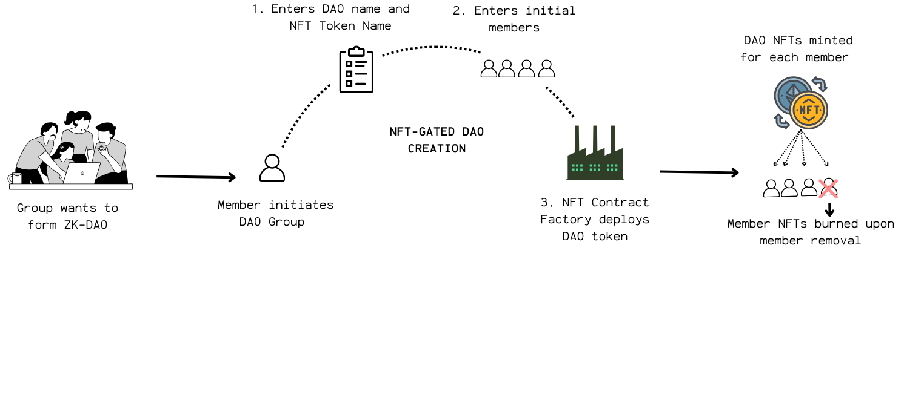

  
  <h1 align="center" style="margin-top: 0.3rem;">IgnitionZK</h1>
  <h3 align="center" style="margin: 0;">ZK-Governed · Modular · Upgradeable Treasury</h3>

  <a href="#quick-start">Getting Started</a> |
  <a href="#">View Demo</a> |
  <a href="./docs/architecture.md">System Architecture</a>

> 🚧 **Project Status**: Alpha - In active development and testing. Not yet ready for production use.

## What is IgnitionZK?

**IgnitionZK** is a privacy-first DAO framework that enables small-to-medium expert groups to govern funds with complete anonymity while maintaining accountability. Using zero-knowledge proofs, members can propose ideas and vote without revealing their identities, while still ensuring that only authorized participants can engage in governance.

### Why Choose IgnitionZK?

- **Privacy + Accountability**: Anonymous proposal creation and voting with verifiable membership
- **Built for Expert Groups**: Optimized for high-impact, focused DAOs where every member matters
- **Fully Modular**: Plug-and-play components with upgradeable infrastructure
- **User-Friendly**: Intuitive UI for DAO creation, proposal submission, and voting

## Table of Contents

* [Key Features](#key-features)
* [IngitionZK Components](#ignitionzk-components)
    * [Layer A: ZK Engine](#layer-a-zk-engine)
    * [Layer B: On-Chain Infrastructure](#layer-b-on-chain-infrastructure)
* [IgnitionZK Lifecycle](#ignitionzk-lifecycle)
    * [Phase 1: DAO Formation and Membership](#phase-1-dao-formation-and-membership)
    * [Phase 2: Anonymous Proposal Submissions](#phase-2-anonymous-proposal-submissions)
    * [Phase 3: Anonymous Voting](#phase-3-anonymous-voting)
    * [Phase 4: Claiming Proposal Awards](#phase-4-claiming-proposal-awards)
    * [Phase 5: Proposal Execution](#phase-5-proposal-execution)

## Key Features 

IgnitionZK delivers a privacy-preserving, modular, and upgradeable governance framework for expert DAOs. Its architecture and lifecycle enable secure, anonymous participation while maintaining transparency and robust fund management.

### 1. **Privacy-Preserving Governance**

- **Anonymous Proposals & Voting:**  
  Members submit proposals and cast votes without revealing their identities, using zero-knowledge proofs (ZKPs).
- **ZK Credential System:**  
  Each member generates a private ZK identity, enabling verifiable yet anonymous participation.

### 2. **Verifiable Membership**

- **NFT-Gated Access:**  
  DAO membership is managed via non-transferable ERC721 NFTs, ensuring only eligible, real-world-verified members can participate.
- **Dynamic Member Management:**  
  Members can be added or removed by minting or burning NFTs.

### 3. **Modular, Upgradeable Smart Contracts**

- **UUPS-Upgradeable Contracts:**  
  Upgradeable controllers for membership, proposals, voting, governance and funding modules built on OpenZeppelin’s UUPS proxy pattern for future-proofing and security.
- **Pluggable Funding Modules:**  
  Funding modules (such as grants or bounties) are designed as plug-and-play components, managed and deployed by IgnitionZK. 

### 4. **Secure Treasury Management**

- **Isolated Beacon Proxy Treasuries:**  
  Each group has its own upgradeable beacon proxy treasury, deployed via a factory for fund segregation and risk mitigation.
- **Timelocked Disbursements:**  
  All outgoing transfers are subject to a mandatory timelock, giving admins time to review or halt suspicious activity.
- **Admin Controls & Emergency Lock:**  
  Only authorized multisig admins can approve, execute, or cancel fund transfers, with the ability to lock the treasury in emergencies.

### 5. **Transparent Lifecycle**

- **Deanonymized Event Logging:**  
  All critical actions (proposals, votes, claims) emit thorough de-anonymized on-chain events for full auditability.
- **Lifecycle Phases:**  
  The governance process is structured into clear phases: Membership, Proposal Submission, Voting, Claiming, and Execution.

### 6. **User-Centric Experience**

- **Intuitive UI:**  
  Guided workflows for DAO creation, proposal submission, voting, and claims, lowering the barrier for expert groups to launch and operate.
- **Customizable Campaigns:**  
  DAOs can define governance campaign durations and proposal templates to fit their unique needs.

---

[➡️ Explore the Architecture](./docs/architecture.md) 

## IgnitionZK Layers

*IgnitionZK's two-layer architecture: ZK Engine (Layer A) and On-Chain Infrastructure (Layer B)*

The IgnitionZK framework combines a zero-knowledge cryptographic engine with a flexible smart contract infrastructure, creating a comprehensive system that balances anonymity with accountability. The ZK Engine (Layer A) provides the cryptographic backbone for secure identity and proof generation, while the On-Chain Infrastructure (Layer B) implements the smart contracts that manage the entire governance lifecycle.

## Layer A: ZK Engine

The ZK Engine enables privacy-preserving governance through specialized zero-knowledge circuits and supporting tools. Using the PLONK ZKP protocol, it allows members to prove statements without revealing underlying data.

**Key Components:**
* **ZK Circuits**: Mathematical constructs for proving membership, proposal submission, voting, and claiming
* **Verifier Contracts**: On-chain components that validate proofs without compromising privacy
* **Off-Chain Tooling**: Utilities for generating ZK identities, managing Merkle trees, and creating proofs

[➡️ Detailed ZK Engine Documentation](./docs/layerA-zk-engine.md) 

**ZK Circuit Docs**:  
[Membership](./zk/circuits/membership/docs-membership_circuit.md) |
[Proposal](./zk/circuits/proposal/docs-proposal_circuit.md) |
[Vote](./zk/circuits/vote/docs-vote_circuit.md) |
[Claim](./zk/circuits/proposal-claim/docs-proposal_claim_circuit.md)

## Layer B: On-Chain Infrastructure 

This layer provides the smart contract architecture built on OpenZeppelin's UUPS proxy pattern, ensuring upgradeability and security for all governance operations.

**Key Components:**
* **Manager Contracts**: Upgradeable controllers for membership, proposals, and voting
* **NFT Membership**: ERC721-based tokens for verifiable group membership
* **Governance Manager**: Central coordinator for protocol upgrades and management
* **Treasury System**: Flexible funding modules for resource allocation

[➡️ Detailed Smart Contract Documentation](./docs/layerB-smart-contracts.md) | [ Architecture Details](./docs/architecture.md)

## IgnitionZK Lifecycle

### Phase 1: DAO Formation and Membership

*Step 1: NFT-Gated DAO formation*

*Step 2: ZK-Credential generation & Merkle Tree management*

*Step 3: Member verification*

DAO creation begins with deploying an ERC721 contract for membership tokens, followed by credential generation for private governance:

1. **DAO Initiation**: Deploy a custom ERC721 contract for the DAO via minimal proxy pattern
2. **Membership NFTs**: Mint non-transferable NFTs to verified members
3. **ZK Credential Generation**: Members create private identity credentials
4. **Merkle Tree Management**: Update the on-chain Merkle root when new member commitments are generated
5. **Member Verification**: Verify membership via zero-knowledge proofs

[➡️ Detailed Membership Documentation](./docs/lifecycle-phase1-membership.md)

### Phase 2: Anonymous Proposal Submissions

*Step 1: Creating a governance campaign*

*Step 2: Submitting proposals anonymously*

Members anonymously submit proposals during governance campaigns:

1. **Governance Campaign**: Create time-bound governance cycles with custom duration
2. **Proposal Creation**: Submit standardized proposals with clear parameters
3. **Anonymous Verification**: Prove membership and proposal uniqueness via ZK proofs

[➡️ Detailed Proposal Documentation](./docs/lifecycle-phase2-proposals.md)

### Phase 3: Anonymous Voting

*Casting a vote*

DAO members vote on proposals anonymously while maintaining verifiability:

1. **Voting Phase**: Eligible members receive proposals in their app inbox
2. **Anonymous Voting**: Cast Yes/No/Abstain votes via ZK proofs
3. **Result Determination**: Proposals pass with sufficient quorum and majority support
4. **Vote Tally Reveal**: Vote proofs are submitted on-chain for verification only when the voting phase has ended

[➡️ Detailed Voting Documentation](./docs/lifecycle-phase3-voting.md)

### Phase 4: Claiming Proposal Awards

*Proposer submits a ZK-proof to claim ownership of an accepted proposal*

Once a proposal passes, a process begins to allow the release of the awarded funds: 

1. **Review Phase**: A designated period after voting ends allows for final review before any funds are claimed or released.
2. **Ownership Claim**: The original proposer generates and submits a ZK-proof to verifiably claim ownership of the passed proposal. This action proves they are the rightful creator without revealing their private identity.
3. **Proposal Claimed Status**: Upon successful verification of the claim proof, the proposal's status is updated to "claimed," officially linking the anonymous submission to the proposer.

If successfully claimed, the proposal can move on to the execution phase.

[➡️ Detailed Claims Documentation](./docs/lifecycle-phase4-claims.md)

### Phase 5: Proposal Execution

*Executing a passed proposal and releasing funds from the DAO treasury*

After a proposal is accepted and successfully claimed, the DAO moves to the execution phase, where funds are securely disbursed from the treasury according to the proposal's parameters. This process is modular, transparent, and governed by multiple layers of checks and timelocks.

1. **Funding Module Trigger**: The system routes the approved proposal to the appropriate funding module based on its type.
2. **Disbursement Request**: The funding module relays the disbursement request to the correct DAO treasury instance.
3. **Treasury Timelock**: The DAO treasury stores the funding request and activates a 3-day timelock before any transfer can be executed, allowing for review and potential cancellation.
4. **Admin Approval & Execution**: After the timelock, the treasury admin (DAO multisig) reviews, approves, and executes the transfer. Only the admin can approve, execute, or cancel requests, and all actions are logged on-chain.
5. **Treasury Lock Mechanism**: For added security, the treasury can be locked in emergencies, halting all outgoing transfers for a set period.
6. **Modular Treasury Deployment**: New, isolated treasury instances can be deployed for each group, ensuring scalable and secure fund management.

This phase ensures that only proposals which have passed all governance checks and have been properly claimed can trigger the release of funds, with robust controls and auditability at every step.

[➡️ Detailed Execution Documentation](./docs/lifecycle-phase5-execution.md)
