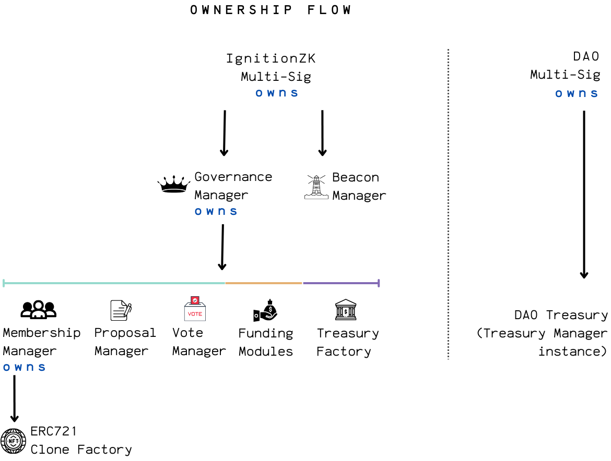

## Layer B: On-Chain Infrastructure 

Layer B is where IgnitionZK’s governance logic and treasury management live. This layer is built for flexibility, upgradeability, and security, so DAOs can evolve over time without losing control or transparency.

The system is organized around a few main contract groups:

- Manager Contracts handle membership, proposals, and voting. Each manager is upgradeable and works under the coordination of the GovernanceManager, which acts as the protocol’s central authority.
- Verifiers are immutable contracts that check zero-knowledge proofs for membership, proposals, and voting. They make sure only valid, private actions are accepted.
- NFT Factory is a lightweight ERC721 clone factory that issues non-transferable membership tokens, so only real, approved members can participate.
- The treasury system allows each DAO to gets its own upgradeable treasury, deployed as a beacon proxy. Treasuries are isolated, upgradeable, and support a range of funding modules (like grants), all managed by the protocol.

Role-based permissions are used throughout, so only authorized parties can make changes to membership, proposals, voting, or treasury actions. Every sensitive operation is protected by these checks, and all upgrades are controlled by multi-signature wallets for added security.

*IgnitionZK smart contract ownership flow*

*Onchain flow per action type*

### Contract Overview

Below is a summary of the main contracts and what they do:

| Contract | Type | Upgradeability | What It Stores | What It Does | Owner |
|---|---|---|---|---|---|
| [MembershipManager](../hardhat/contracts/managers/MembershipManager.sol) | Manager | UUPS | Merkle roots | Deploys group NFTs, manages members, verifies membership | GovernanceManager |
| [ProposalManager](../hardhat/contracts/managers/ProposalManager.sol) | Manager | UUPS | Proposal nullifiers | Verifies proposal submissions and claims | GovernanceManager |
| [VoteManager](../hardhat/contracts/managers/VoteManager.sol) | Manager | UUPS | Vote nullifiers, proposal results, quorum params | Verifies votes, tracks proposal status | GovernanceManager |
| [MembershipVerifier](../hardhat/contracts/verifiers/MembershipVerifier.sol) | Verifier | Immutable | — | Checks membership proofs | — |
| [ProposalSubmissionVerifier](../hardhat/contracts/verifiers/ProposalVerifier.sol) | Verifier | Immutable | — | Checks proposal submission proofs | — |
| [ProposalClaimVerifier](../hardhat/contracts/verifiers/ProposalVerifier.sol) | Verifier | Immutable | — | Checks proposal claim proofs | — |
| [VoteVerifier](../hardhat/contracts/verifiers/VoteVerifier.sol) | Verifier | Immutable | — | Checks voting proofs | — |
| [ERC721IgnitionZK](../hardhat/contracts/token/ERC721IgnitionZK.sol) | NFT Factory | Clone | — | Deploys NFT clones for DAOs | MembershipManager |
| [GovernanceManager](../hardhat/contracts/governance/GovernanceManager.sol) | Governance | UUPS | Funding module addresses | Manages modules, delegates calls, protocol admin | IgnitionZK MultiSig |
| [TreasuryManager](../hardhat/contracts/treasury/TreasuryManager.sol) | Treasury | Beacon Proxy | Funding requests | Handles treasury logic, timelocks, admin controls | DAO Treasury MultiSig |
| [BeaconManager](../hardhat/contracts/treasury/BeaconManager.sol) | Treasury | Beacon | Implementation address | Upgrades all treasuries at once | IgnitionZK MultiSig |
| [TreasuryFactory](../hardhat/contracts/treasury/TreasuryFactory.sol)  | Treasury | Immutable | Proxy addresses | Deploys new treasury instances | GovernanceManager |
| [GrantModule](../hardhat/contracts/fundingModules/GrantModule.sol) | Funding Module | UUPS | — | Handles grant funding requests | GovernanceManager |
| Quadratic Funding Module | Funding Module | (Planned) | — | (Planned) Quadratic funding logic | GovernanceManager |

---

