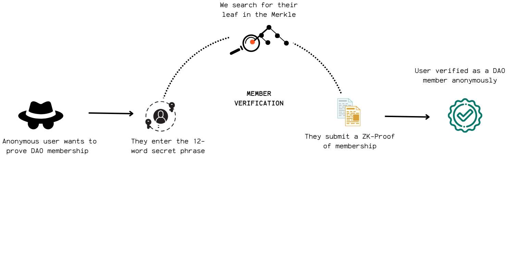

### Phase 1: DAO Formation and Membership
#### Step 1.1 DAO Initiation

A DAO is initiated when an ERC721 contract with the DAO's name and token symbol is deployed. This is achieved through a minimal proxy (EIP-1167) contract: a main, immutable ERC721 implementation contract acts as a factory for all subsequent clones.

#### Key Features

- **Implementation Contract:** [`ERC721IgnitionZK`](hardhat/contracts/token/ERC721IgnitionZK.sol)
- **Role-Based Access:** Uses OpenZeppelin's AccessControl for explicit roles:
  - `default_admin_role`, `minter_role`, `burner_role` are granted to the Membership Manager.
  - Role transfers and sensitive actions are gated via delegated functions, callable only by the Governance Manager.
- **Customizable Metadata:** Token name and symbol are defined by the user in the UI.

#### Step 1.2 ERC721 Membership NFTs

The DAO administrator invites the initial cohort of members through the UI, triggering the minting of ERC721 membership NFTs from the DAO's dedicated contract. Each NFT serves as verifiable proof of valid group membership.

#### Key Features

- **Soulbound:** Membership NFTs are non-transferable, ensuring DAO participation is tied to the individual's verified identity.
- **Burnable:** When a member leaves the group, their NFT is burned, terminating their DAO participation.
- **On-Chain Management:** All minting and burning actions are managed by the [`MembershipManager`](hardhat/contracts/membership/MembershipManager.sol) contract, with delegated authority from the Governance Manager.

#### Step 1.3 Member ZK Credential Generation

Only members holding a valid membership NFT can generate their Zero-Knowledge credentials for private DAO interactions.

#### Methodology

*Script: [generateCredentials.js](frontend/src/scripts/generateCredentials.js)*

The cryptographic steps involved in securely generating a unique Zero-Knowledge identity for each DAO member are as follows:
1. **Mnemonic phrase generation:** A random 12-word mnemonic phrase is generated from 128 bits of entropy, serving as the foundational secret.
2. **Seed derivation:** A cryptographic seed is securely derived from this mnemonic phrase.
3. **Identity key derivation:** Using HKDF (HMAC-based Key Derivation Function) with the mnemonic seed, the essential trapdoor and nullifier keys are deterministically derived.
4. **Final identity components:** The ultimate identity trapdoor and identity nullifier values are then computed via the SNARK-friendly Poseidon hash function.
5. **Identity commmitment:** The final public identity commitment is calculated as a Poseidon hash of these two private components: `commitment = Poseidon(trapdoor, nullifier)`

#### Step 1.4 Merkle Tree Creation 

After generating a new member's identity commitment, the DAO's Merkle Tree is updated and a new Merkle root is computed. This ensures the on-chain representation of DAO membership is always current.

#### Methodology

*Script: [merkleTreeService.js](frontend/src/scripts/merkleTreeService.js)*

1. **Tree Construction:** The Merkle Tree is built from the DAO group's identity commitments (leaves) using the @zk-kit/imt library.
2. **Fixed Depth:** The tree maintains a fixed depth of 10 levels to align with the Membership Circom circuit's depth. This corresponds to a maximum number of 1024 leaves.
3. **Hashing & Arity:** Leaves are hashed in pairs (arity = 2) using the SNARK-friendly Poseidon hash function.
4. **Padding:** A designated zero element fills any empty leaves, ensuring the entire tree is fully populated across all levels.
5.  **Root Storage:** The newly computed Merkle root is securely saved both off-chain and on-chain within the MembershipManager contract.

#### Step 1.5 Member Verification

When a DAO member wants to perform an action, like submitting or voting on a proposal, they first need to prove they're an eligible member. This membership verification is an integrated component
within both the proposal submission and voting processes via `membership_circuit.circom`.

#### Verification Flow

1. **Mnemonic input:** The user enters their mnemonic phrase.
2. **ZK Credential Derivation:** From this mnemonic, we deterministically derive their identity trapdoor, a nullifier, and their final ZK commitment.
3. **Merkle Tree Check:** We then check if the derived identity commitment exists as a leaf in the DAO's Merkle Tree. If it does, we pinpoint its exact position within the tree.
4. **Membership Proof Generation:** Using this known position, we generate a Merkle Proof of membership. This proof includes all the necessary sibling leaves (known as path elements) and their left/right positions (path indices) along the path from the user's leaf all the way up to the Merkle root.
5. **Proof Assembly:** The complete input for this Membership Proof consists of the identity trapdoor, identity nullifier, the expected Merkle root, the path elements, the path indices, and a DAO identifier to provide context.
6. **Validation by Membership Manager:** The proof is submitted to the `MembershipManager` via a delegated function from the `GovernanceManager` (e.g., `delegateVerifyMembership`). The contract verifies the proof using the on-chain Merkle root and the `MembershipVerifier`.

---
**References:**
- [`MembershipManager.sol`](../hardhat/contracts/managers/MembershipManager.sol)
- [`membership_circuit_instance.circom`](../zk/circuits/membership/membership_circuit_instance.circom)
- [`GovernanceManager.sol`](../hardhat/contracts/governance/GovernanceManager.sol)
- [`frontend/src/scripts/merkleTreeService.js`](../frontend/src/scripts/merkleTreeService.js)
- [`frontend/src/scripts/generateCredentials.js`](../frontend/src/scripts/generateCredentials-browser-safe.js)
- [`frontend/src/scripts/generateZKProof.js`](../frontend/src/scripts/generateZKProof.js)