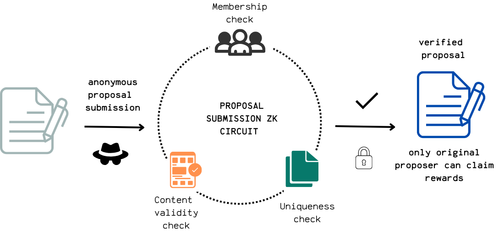

### Phase 2: Anonymous Proposal Submissions

IgnitionZK makes sure that only real, verified members can shape the DAO’s future. Every member is required to generate zero-knowledge credentials, which are used for all governance actions from this point forward.

#### Step 2.1 Launching a Governance Campaign


Once the initial members have their credentials, anyone in the group can start a new governance campaign. This is a self-contained cycle where proposals are submitted, voted on, and reviewed. To kick things off, a member submits a campaign creation request, which the DAO must approve with a vote.

If the campaign is approved, it starts on the chosen date and runs through three phases: proposal submission, voting, and a review period where proposal creators can claim ownership of accepted proposals. Campaigns can be launched whenever needed, and each one can have its own start date and duration to fit the group’s needs.

#### Step 2.2 Creating Proposals

When the campaign begins, members can submit proposals using a template set by the DAO. This keeps proposals clear and consistent. To submit, a member selects the active campaign, fills in the required details (like title, description, type, and funding amount), and uploads the proposal document.

The document is uploaded to IPFS, and its unique CID is combined with the proposal details to create a content hash that represents the proposal on-chain.

#### Step 2.3 Submitting Proposals Anonymously



To keep proposers anonymous but still ensure each submission is valid, IgnitionZK uses a zero-knowledge proof generated by the `proposal_circuit.circom` circuit. This proof is submitted on-chain and checked by the DAO’s contracts.

The proof verifies that: 
- The submitter is a verified DAO member
- The proposal is not a duplicate within the campaign. A submission nullifier, derived from the proof, is used to prevent the same proposal from being submitted more than once.
- The proposal content hash correctly represents the submitted proposal and its details.

**Onchain Flow:**

```
User (Proposer) → Generate ZK-Proof (proposal_circuit.circom) → Relayer → GovernanceManager (delegateVerifyProposal) → ProposalManager → ProposalVerifier → Store Proposal
```

- The user generates a ZK-Proof off-chain using `proposal_circuit.circom`.
- The proof and proposal details are submitted to the `GovernanceManager`, which delegates verification to the `ProposalManager` via `delegateVerifyProposal`.
- The `ProposalManager` verifies the proof and, if valid, records the proposal on-chain.

Each successful ZK submission also generates a unique claim nullifier, which the legitimate creator will later use to claim rewards if their proposal is accepted.

---
**References:**
- [`proposal_circuit.circom`](../zk/circuits/proposal/proposal_circuit.circom)
- [`ProposalManager.sol`](../hardhat/contracts/managers/ProposalManager.sol)
- [`GovernanceManager.sol`](../hardhat/contracts/governance/GovernanceManager.sol)
- [`frontend/src/scripts/generateZKProof.js`](../frontend/src/scripts/generateZKProof.js)
