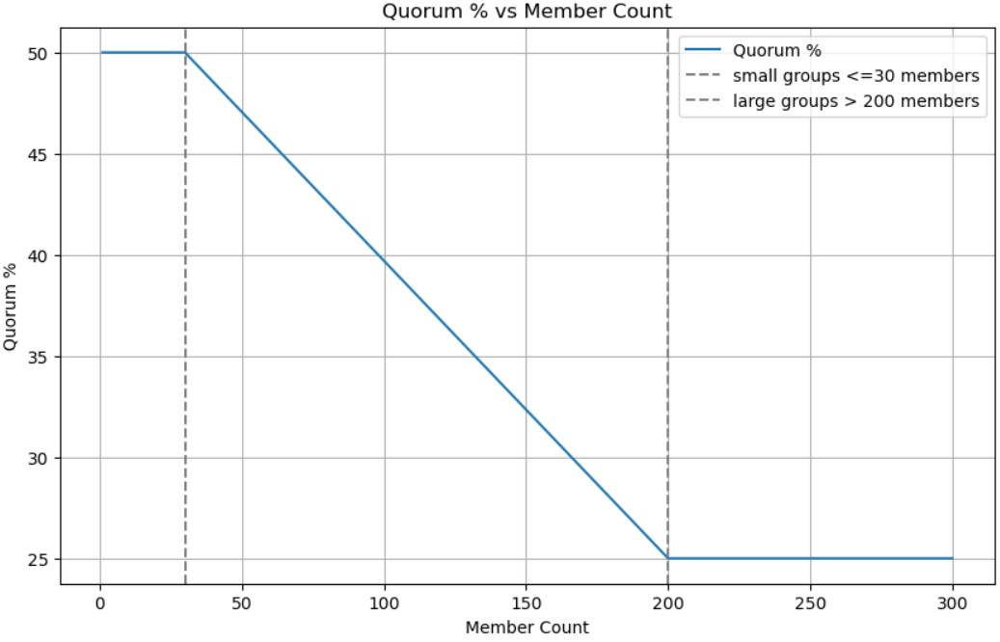

### Phase 3: Anonymous Voting

#### Step 3.1 Voting Phase

Once the proposal submission phase concludes, all verified proposals become available for voting in the app's Inbox section. To ensure the integrity of the governance cycle, the voter base is locked in at the campaign's start. Only members who had generated their ZK credentials at that time are eligible to vote, and no new members can be added until the campaign has ended.

#### Step 3.2 Anonymous Vote Submissions


Voting is conducted confidentially and independently for each proposal, with every vote (Yes, No, or Abstain) submitted anonymously through a Zero-Knowledge Proof (ZKP) generated by the `vote_circuit.circom`. The ZK circuit and onchain verification provide strong guarantees for the voting process:

* **Verified Participation**: Only verified DAO members (with valid credentials) can cast a vote, enforced by the ZK circuit and checked by the `VoteManager` contract during vote proof verification.
* **Vote Uniqueness**: Each member can vote only once per proposal, enforced by a nullifier check in the `VoteManager`.
* **Valid Vote Content**: The vote cast is a valid choice (Yes, No, or Abstain), enforced by circuit constraints.
* **Correct Proposal Binding**: The vote is securely linked to its intended proposal, preventing votes from being misdirected or miscounted.

Votes are submitted to the `GovernanceManager` contract, which delegates verification to the `VoteManager` via the `delegateVerifyVote` function. The `VoteManager` then verifies the ZK proof onchain and updates the proposal's vote tally if the proof is valid.


**Onchain Flow:**

```
User (Voter) → Generate ZK-Proof (vote_circuit.circom) → Relayer → GovernanceManager (delegateVerifyVote) → VoteManager → VoteVerifier → Update Proposal Tally in VoteManager
```

#### Step 3.3 Proposal Status

For a proposal to be officially marked as accepted, it must meet three key requirements:

* **Quorum**: The total number of votes cast must meet a specified quorum threshold.
* **Majority**: A simple majority of "Yes" votes must be achieved.
* **Minimum Size**: The DAO's membership must exceed a minimum size threshold (currently set to 2 members).

The proposal status is computed every time a new verified vote is tallied onchain.

**Dynamic Quorum Calculation**

The required quorum is not a fixed number; it is set dynamically onchain and scales with the size of the DAO to ensure that participation is always meaningful. The tiers below outline how the quorum is determined, using the terms "small," "medium," and "large" to denote relative differences in DAO size:

* **Small DAOs**: A flat 50% quorum is required to pass a proposal.
* **Medium DAOs**: The quorum is linearly interpolated based on the group's size, balancing participation with efficiency.
* **Large DAOs**: The quorum requirement scales down to 25%, making governance more agile for larger groups.



---
**References:**
- [`VoteManager.sol`](../hardhat/contracts/managers/VoteManager.sol)
- [`vote_circuit.circom`](../zk/circuits/vote/vote_circuit.circom)
- [`GovernanceManager.sol`](../hardhat/contracts/governance/GovernanceManager.sol)
- [`frontend/src/scripts/generateZKProof.js`](../frontend/src/scripts/generateZKProof.js)